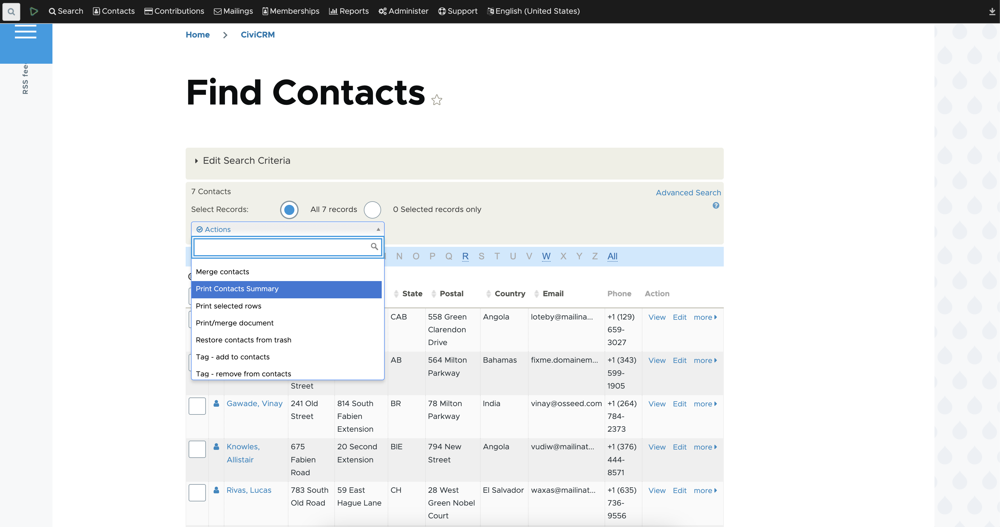

# Contacts Summary Print Extension



The extension is licensed under [AGPL-3.0](LICENSE.txt).

## Requirements

- **PHP:** v7.4+
- **CiviCRM:** v5.71+

## Installation

> Checkout [Instructions](instructions.pdf) PDF file, to know more.

### Web UI

To install the extension using the web UI, follow the steps outlined in the [CiviCRM Sysadmin Guide](https://docs.civicrm.org/sysadmin/en/latest/customize/extensions/).

### CLI (Command Line Interface) / Zip

Sysadmins and developers can manually extract the `contacts-summary-print.zip` file into the CiviCRM extension directory. After extraction, use the [cv tool](https://github.com/civicrm/cv) to enable the extension:

```bash
cv en contacts_summary_print
```

Alternatively, you can install it via the `CiviCRM Extensions` page [here](/civicrm/admin/extensions).

## Getting Started

1. **Installation:** Follow the installation instructions above to install the extension.
2. **Configuration:** After installation, configure the extension as needed through the CiviCRM UI.

## Known Issues

- **DOCX Editing Limitation:** Currently, the content of `DOCX` files cannot be updated by editing the `Contacts Summary Print` custom message template, unlike PDF files.

## Step to Import contacts

1. Install `backup_migrate` module in drupal for backup.

  ```shell
  composer require 'drupal/backup_migrate:^5.0'
  ```

2. Enable it & take backup of DB.

  ```shell
  ./vendor/bin/drush en backup_migrate
  ```

3. Now create all tags 1st.

4. Now open sheet & filter them by tags then copy(**also copy header**) it in separate sheet to export.

5. Now import that exported contact with same field & contact type also assign existing tags while import.
